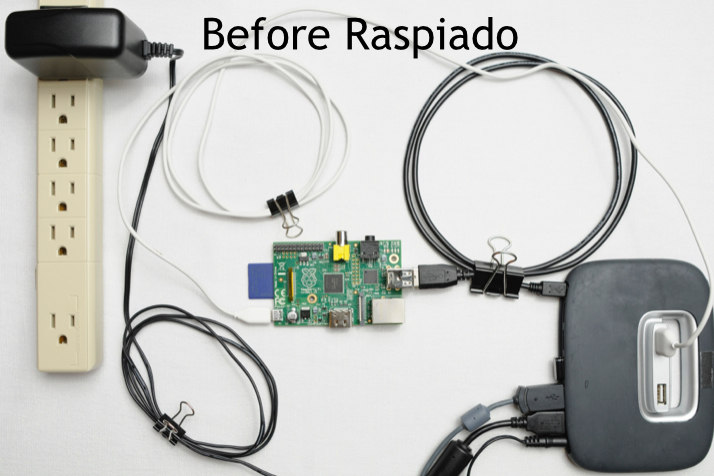
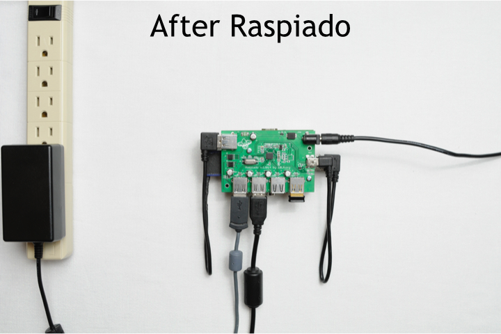
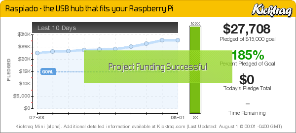
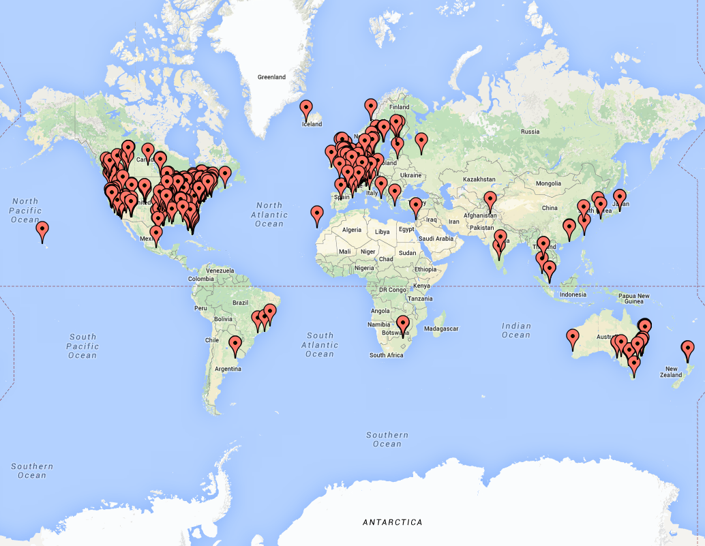

## Raspiado

A USB hub that fits in the space and footprint of the existing Raspberry Pi.  Compatible with the RPi B, RPi B+, and RPi 2.

Power your Pi, add USB ports, and look great doing it!

******************
### File Descriptions
[4PxU_RPISB Specification.docx](https://github.com/10la/Raspiado/blob/master/4PxU_RPISB%20Specification.docx) is the hardware specification document created by Mindlab Tech for Raspiado.  It represents a formalized document that governs what functions and requirements Raspiado needed and how those things would be achieved.

[PCB Design Files](https://github.com/10la/Raspiado/tree/master/PCB%20Design%20Files) are the EAGLE files for the Raspiado board.

It includes 2 folders- the main design files are in [4PxU_RPi Rev B 18July2014](https://github.com/10la/Raspiado/tree/master/PCB%20Design%20Files/4PxU_RPi%20Rev%20B%2018July2014).  I had a small issue with the board logo and the resulting change are stored in [2014-10-3 new logo](https://github.com/10la/Raspiado/tree/master/PCB%20Design%20Files/2014-10-3%20new%20logo)

When I went to production with Raspiado, I required a few crossreferenced components in order to function with the inventory items that my PCB manufacturer preferred.  You can find those in the [BOM_Crossreferences](https://github.com/10la/Raspiado/blob/master/PCB%20Design%20Files/BOM_Raspiado_V1P4_crossreferences.xlsx) spreadsheet.

******************
### Kickstarter

Raspiado would have never seen the light of day with it's attractive, intelligent, and supportive backers.

When I started the project, I never knew that I'd be able to create something that would be appreciated by people all over the world.
